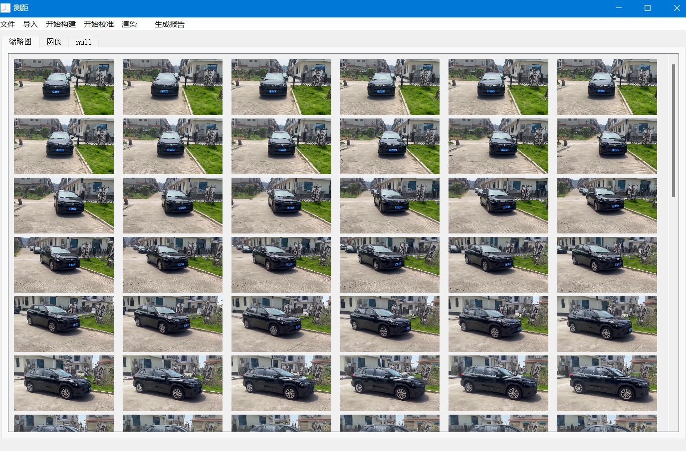
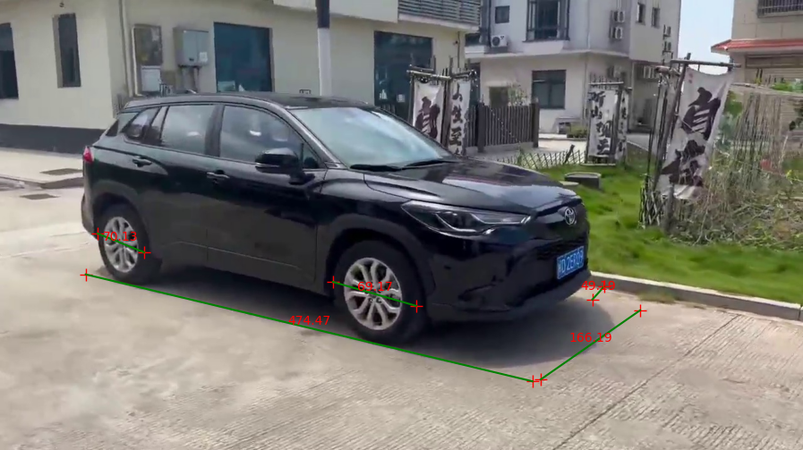

基于交通事故现场视频，利用 COLMAP 进行 SFM 三维重建，通过中间文件保存的相机内外参数、点云和深度图，实现图像坐标到三维点云的精准映射。

自动校准点云中单位长度的物理距离：  
通过 YOLO 检测车牌位置，根据端点领域像素对应的深度值方差找到最好的车牌视角；接着计算车牌端点的对应点云距离；根据车牌固定长度换算出
每单位点云距离的物理长度，最终自动化还原真实场景尺寸。

计算物体之间的水平距离：  
借助语义分割得到地面像素，转换为点云地面点，拟合地面方程。后续所有目标点都投影到地面，再进行测距。利用
标准车牌长度标定比例关系。

采用 3D Gaussian Splatting 融合重建出可高速渲染的三维场景。
为事故分析提供高精度数据支持。  

conda create -n gaussian_splatting python=3.7
conda activate gaussian_splatting

pip install torch==1.12.1+cu116 torchaudio==0.12.1+cu116 torchvision==0.13.1+cu116 -f https://download.pytorch.org/whl/torch_stable.html
pip install tqdm opencv-python  joblib plyfile matplotlib  scikit-learn open3d fastapi numpy  python-docx==0.8.11 pillow 

python MyApplication.py

